# AI Swarm v2

[](https://opensource.org/licenses/Apache-2.0)

> Production-ready multi-agent AI orchestration powered by Temporal.io

**AI Swarm v2** is a complete rewrite featuring autonomous operation:
- **Durable Execution**: Workflows survive crashes and restarts
- **Interactive Chat**: Refine tasks through conversation with Planner
- **Auto-Approval Mode**: Set it and forget it with intelligent rollback
- **Self-Healing**: Loop detection and automatic recovery
- **Google OAuth**: Secure access with email allowlist
- **Real-time Dashboard**: Monitor and control from a modern web UI
- **Context-Aware Mapping**: Mount your project codebase directly to agents
- **Token Efficiency**: Grounded planning using specific documentation folders
- **Chat Management**: Persistent history with easy conversation deletion


## Quick Start

### Prerequisites
- Docker & Docker Compose
- Node.js 20+ / pnpm 8+
- Gemini CLI (authenticated)
- Google Cloud OAuth credentials
- Traefik 2.0+ (running on `traefik-public` network)
- DNS A records for your domain (e.g., `*.ai-swarm.com`)

### 5-Minute Setup

```bash
# 1. Clone the repository
git clone https://github.com/YOUR_USERNAME/ai-swarm-v2.git
cd ai-swarm-v2

# 2. Configure environment
cp .env.example .env
nano .env

# 3. Run the Setup Wizard
# Handles deployment, authentication, and startup
./setup.sh
```

📖 **Full setup guide:** [docs/SETUP.md](docs/SETUP.md)

## Architecture

```mermaid
graph TB
    subgraph "Portal"
        UI[Next.js Dashboard]
        Auth[Google OAuth]
    end
    
    subgraph "Temporal Cluster"
        TS[Temporal Server]
        TQ[Task Queue]
    end
    
    subgraph "Worker Pool (4 instances)"
        W1[Worker 1]
        W2[Worker 2]
        W3[Worker 3]
        W4[Worker 4]
    end
    
    subgraph "Agents"
        P[🧠 Planner]
        C[💻 Coder]
        D[🚀 Deployer]
        S[👁️ Supervisor]
    end
    
    UI --> Auth
    Auth --> TS
    TS --> TQ
    TQ --> W1 & W2 & W3 & W4
    W1 & W2 & W3 & W4 --> P & C & D & S
```



## Features

### Interactive Planner Chat

Chat with Planner to refine your task before execution:

1. Describe your task
2. Planner asks clarifying questions
3. Refine until plan is solid
4. Click "Create Task" to execute
5. **Manage**: Use the trash icon to delete finished or irrelevant conversations to keep your history clean.

### Kill Switch

Emergency stop all operations:

```bash
# Via API
curl -X POST http://localhost:3000/api/swarm -d '{"action":"pause"}'

# Resume
curl -X POST http://localhost:3000/api/swarm -d '{"action":"resume"}'
```

Or use the toggle in the portal header.

### Worker Access

Workers are Docker containers:

```bash
# Access a worker shell
docker exec -it ai-swarm-worker-1 /bin/bash

# Run Gemini CLI manually
docker exec -it ai-swarm-worker-1 gemini

# View logs
docker logs -f ai-swarm-worker-1
```

## Project Structure

```
ai-swarm-v2/
├── apps/
│   ├── portal/          # Next.js dashboard + chat
│   └── cli/             # Command-line tool
├── packages/
│   ├── shared/          # Types, LLM client, logger
│   ├── workflows/       # Temporal workflows & activities
│   └── worker/          # Temporal worker entry point
├── prompts/             # System prompts for agents
├── docker/              # Docker configurations
├── docs/                # Documentation
├── deploy.sh            # Interactive deployment
├── auth-gemini.sh       # Worker Gemini authentication
└── teardown.sh          # Clean removal
```

## Configuration

### Environment Variables

| Variable | Description | Required |
|----------|-------------|----------|
| `GITHUB_TOKEN` | GitHub PAT | ✅ |
| `GITHUB_REPO` | Target repo (owner/repo) | ✅ |
| `PROJECT_DIR` | Path to project codebase | ✅ |
| `CONTEXT_FOLDER`| Project documentation folder | Recommended (`docs/context`) |
| `GOOGLE_CLIENT_ID` | OAuth client ID | ✅ |
| `GOOGLE_CLIENT_SECRET` | OAuth client secret | ✅ |
| `ALLOWED_EMAILS` | Comma-separated allowlist | Recommended |
| `EMAIL_API_KEY` | Email provider key | Optional |

## Web Dashboard

- **Dashboard**: http://localhost:3000
- **Temporal UI**: http://localhost:8233


## User Management

Since the app is typically in **Testing** mode on Google Cloud, adding a user requires two steps:

### 1. Google Cloud (The Gatekeeper)
1. Go to [Google Cloud Console > OAuth Consent Screen](https://console.cloud.google.com/apis/credentials/consent)
2. Under **Test users**, click **+ Add users**
3. Enter the user's email address
4. *Effect:* Google allows them to sign in. Without this, they get "Access blocked".

### 2. Application Allowlist (The Bouncer)
1. Edit your `.env` file on the server: `nano .env`
2. Add the email to `ALLOWED_EMAILS` (comma-separated):
   ```bash
   ALLOWED_EMAILS=me@example.com,new-user@example.com
   ```
3. Restart the portal: `docker compose restart portal`
4. *Effect:* The app grants them access. If this list is empty, all Google-authenticated users are allowed.

## Tear Down

```bash
./teardown.sh
```

This removes all containers, volumes, and generated files.

## License

Apache 2.0 - See [LICENSE](LICENSE)

---

Built with ❤️ using Temporal.io, Next.js, NextAuth, and Gemini CLI
