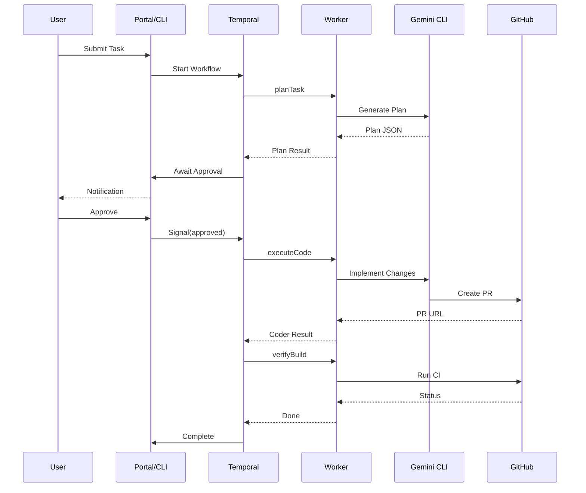

# AI Swarm v2 - Architecture

This document provides technical details about the AI Swarm v2 architecture.

## Overview

AI Swarm v2 is built on **Temporal.io**, a durable execution platform that provides:
- Automatic retries with configurable backoff
- Workflow state persistence across crashes
- Built-in observability and debugging
- Scalable worker pools

## Core Concepts

### Workflows

Workflows are the top-level orchestration units. They are:
- **Deterministic**: Same inputs always produce same outputs
- **Durable**: State is persisted after each step
- **Interruptible**: Can pause for human input (signals)

```typescript
// Example: DevelopFeature workflow
export async function developFeature(input: DevelopFeatureInput): Promise<DevelopFeatureOutput> {
  // Step 1: Plan (activity)
  const plan = await planTask(task);
  
  // Step 2: Wait for approval (signal)
  await condition(() => approved, '24h');
  
  // Step 3: Code (activity)
  const pr = await executeCode(plan);
  
  // Step 4: Verify (activity)
  await verifyBuild(pr);
}
```

### Activities

Activities are the actual work units. They:
- Execute non-deterministic code (I/O, LLM calls)
- Are automatically retried on failure
- Run in worker processes

| Activity | Role | Purpose |
|----------|------|---------|
| `planTask` | Planner | Creates implementation plans |
| `executeCode` | Coder | Implements code, creates PRs |
| `verifyBuild` | Deployer | Runs builds and tests |
| `performHealthCheck` | Supervisor | Checks system health |
| `sendNotification` | - | Sends email alerts |

### Workers

Workers poll Temporal for tasks and execute workflows/activities:
- Multiple workers can run in parallel
- Each worker handles multiple concurrent tasks
- Workers are stateless and horizontally scalable

## Data Flow



## Package Structure

### @ai-swarm/shared

Core utilities shared across all packages:

```
packages/shared/
├── src/
│   ├── types.ts      # TypeScript interfaces
│   ├── llm.ts        # Gemini CLI wrapper with cascade
│   ├── logger.ts     # Structured logging (Pino)
│   └── index.ts      # Exports
└── package.json
```

### @ai-swarm/workflows

Temporal workflows and activities:

```
packages/workflows/
├── src/
│   ├── workflows/
│   │   ├── develop-feature.ts   # Main development workflow
│   │   ├── self-heal.ts         # Health monitoring workflow
│   │   └── index.ts
│   ├── activities/
│   │   ├── planner.ts           # Planning activity
│   │   ├── coder.ts             # Coding activity
│   │   ├── deployer.ts          # Deployment activity
│   │   ├── supervisor.ts        # Health check activity
│   │   ├── notification.ts      # Email activity
│   │   └── index.ts
│   └── index.ts
└── package.json
```

### @ai-swarm/worker

Temporal worker entry point:

```
packages/worker/
├── src/
│   ├── index.ts        # Worker startup
│   └── telemetry.ts    # OpenTelemetry setup
└── package.json
```

### @ai-swarm/portal

Next.js web dashboard:

```
apps/portal/
├── src/
│   ├── app/
│   │   ├── page.tsx           # Dashboard
│   │   ├── submit/            # Task submission
│   │   ├── workflows/         # Workflow list
│   │   └── api/               # API routes
│   ├── components/
│   │   ├── AgentGrid.tsx      # Agent cards
│   │   ├── WorkflowList.tsx   # Workflow list
│   │   └── QuickStats.tsx     # Stats cards
│   └── lib/
│       └── temporal.ts        # Temporal client
└── package.json
```

### @ai-swarm/cli

Command-line interface:

```
apps/cli/
├── src/
│   └── index.ts       # CLI commands
└── package.json
```

## Gemini CLI Integration

The LLM integration uses Gemini CLI with model cascade:

```typescript
const MODEL_CASCADE = {
  planner: ['gemini-2.5-pro', 'gemini-2.5-flash'],
  coder: ['gemini-2.5-flash', 'gemini-2.5-pro'],
  // ...
};

async function invokeGeminiCLI(prompt, options) {
  for (const model of MODEL_CASCADE[options.role]) {
    try {
      return await runGemini(prompt, model);
    } catch (error) {
      // Try next model
    }
  }
  throw new Error('All models exhausted');
}
```

## Observability

### Logging

Structured JSON logs via Pino:

```json
{
  "level": "info",
  "time": "2024-01-15T10:30:00.000Z",
  "service": "ai-swarm",
  "event": "activity_complete",
  "role": "planner",
  "activity": "planTask",
  "durationMs": 5432,
  "success": true
}
```

### Metrics (OpenTelemetry)

Exported to Prometheus:
- `ai_swarm_activity_duration_seconds`
- `ai_swarm_workflow_started_total`
- `ai_swarm_llm_invocations_total`

### Tracing

Distributed tracing via OpenTelemetry:
- Automatic HTTP/fetch instrumentation
- Custom spans for LLM calls
- Correlation between workflows and activities

### Dashboards

Grafana dashboards available at `http://localhost:3001`:
- Workflow execution rates
- Activity success/failure rates
- LLM latency and error rates

## Scaling

### Worker Scaling

```bash
# Run multiple workers
pnpm worker &
pnpm worker &
pnpm worker &
```

Or with Docker:

```yaml
services:
  worker:
    deploy:
      replicas: 3
```

### Temporal Scaling

For production, use Temporal Cloud or a properly scaled self-hosted cluster.

## Security Considerations

1. **Secrets**: Store in environment variables or secrets manager
2. **Docker Socket**: Only mount for supervisor container
3. **Portal Auth**: Add API key or OAuth for production
4. **Git Access**: Use minimal-scope tokens
